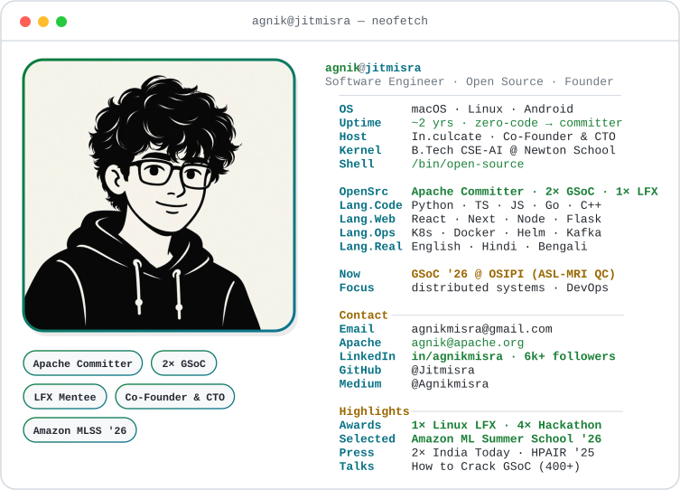

<a href="https://github.com/Jitmisra">
  <picture>
    <source media="(prefers-color-scheme: dark)" srcset="./assets/dark_mode.svg">
    
  </picture>
</a>

---

### 🌱 Currently

- 🔭 &nbsp;**GSoC 2026 @ OSIPI** — building a Python ASL-MRI quality-control toolbox
- 🧑‍⚖️ &nbsp;**Apache Committer** — reviewing & merging on `apache/kvrocks-controller`
- 🚀 &nbsp;**Co-Founder & CTO @ In.culcate** — a Gen-Z OTT platform for Indian culture
- 🌍 &nbsp;Open source across **Apache · CNCF · Linux Foundation · Honeynet**

 
<i>“I've always wanted to be part of something that impacts billions of lives.”</i>

